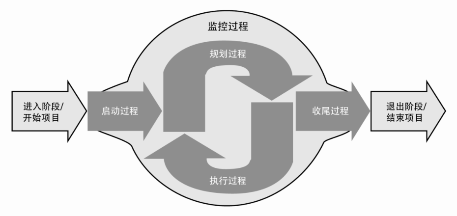
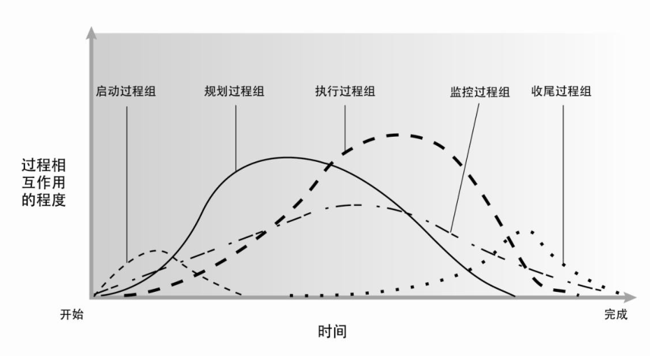
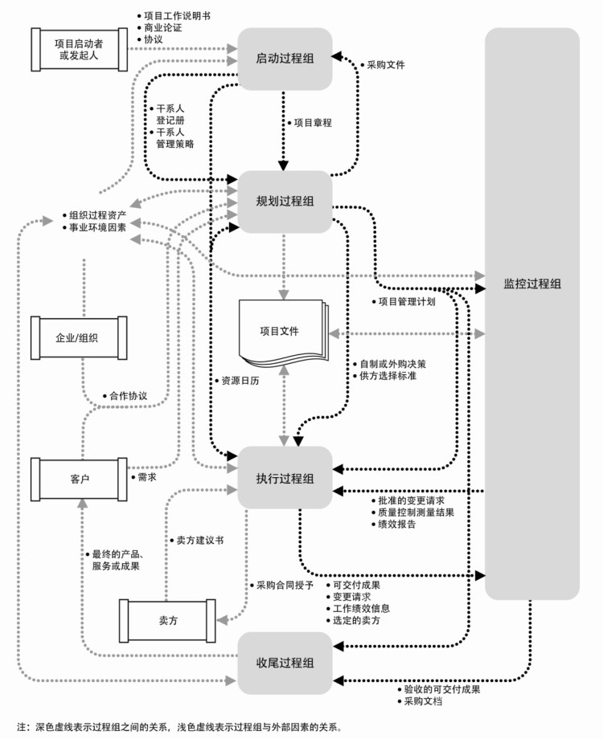
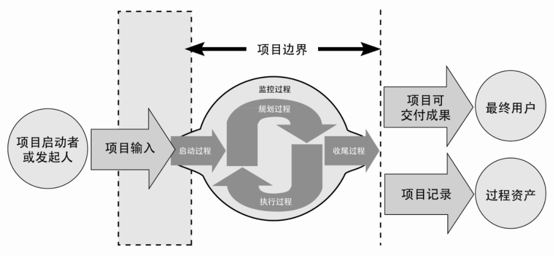
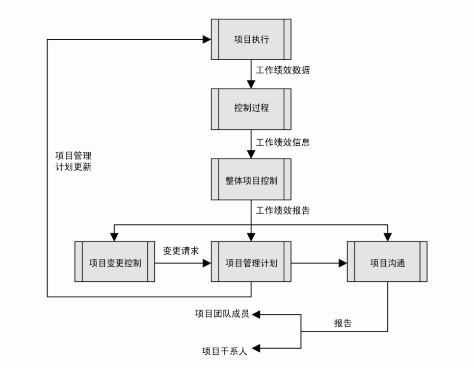

项目管理过程
==============================

　　项目管理就是将知识、技能、工具、与技术应用于项目活动，以满足项目的要求。

　　过程是为创建遇到的产品、服务或成果而执行的一系列相互关联的行动和活动。

　　项目管理是一种整合性工作，要求每个项目过程和产品过程都与其他过程恰当的配合联系，以便彼此协调。

　　为了取得项目的成功，项目团队应该：

    + 选择适用的过程来实现项目目标；

    + 使用经定义的方法来满足要求；

    + 建立并维持与干系人的适当沟通与互动；

    + 遵守要求以满足干系人的需要和期望；

    + 在范围、进度、预算、质量、资源和风险等相互竞争的制约因素之间需求平衡，以完成特定的产品、服务或成果。

.. rubric:: 项目管理过程间的相互作用

.. rubric:: 项目管理过程组

.. rubric:: 启动过程组

　　*定义* 一个新项目或现有项目的一个新阶段， *授权* 开始该项目或阶段的一组过程。

　　*活动*：定义初步范围和落实初步财务资源，识别那些将相互作用并影响项目总体结果的内外部干系人，选定项目经理。

　　*目的*：协调相关方期望与项目目的，告知相关方项目范围和目标，并商讨他们对项目及相关阶段的参与将如何有助实现其期望。

　　*作用*：确保只有符合组织战略目标的项目才能立项，以及在项目开始时就认真考虑商业论证、项目效益和相关方。

.. rubric:: 规划过程组

　　*明确* 项目范围，定义和优化目标，并为实现目标 *制定* 行动方案的一组过程。、

　　*活动*：制定用于指导项目实施的项目管理计划和项目文件。

　　*作用*：为成功完成项目或阶段确定战略、战术及行动方案和路线。

.. rubric:: 执行过程组

　　*完成* 项目管理计划中确定的工作，以满足项目规范要求的一组过程。

　　*作用*：根据计划执行为满足项目要求、实现项目目标所需的项目工作。

.. rubric:: 监控过程组

　　*跟踪、审查和调整* 项目进展与绩效， *识别* 必要的计划变更并 *启动* 相应变更的一组过程。

　　*作用*：定期（或在特定事件发生时、在异常情况出现时）对项目绩效进行测量和分析，从而识别与项目管理计划的偏差。

.. rubric:: 收尾过程组

　　*完结* 所有过程组的所有活动，正式结束项目或阶段或合同责任的一组过程。

　　*作用*：确保恰当地关闭阶段、项目和合同。

.. rubric:: 项目信息

　　*工作绩效数据*：在执行项目工作的过程中，从每个正在执行的活动中收集到的原始观察结果和策略值。例如，工作完成百分比、质量和技术绩效测量值、进度活动的开始和结束日期、变更请求的数量、缺陷数量、实际成本和实际持续时间等。

　　*工作绩效信息*：从各控制过程中收集并结合相关背景和跨领域关系，进行整合分析而得到的绩效数据。例如，可交付成果的状态、变更请求的执行情况、预测的完工估算。

　　*工作绩效报告*：为制定决策、提出问题、采取行动或引起关注，而汇编工作绩效信息，所形成的实物或电子项目文件。例如，状况报告、备忘录、论证报告、信息札记、电子报表、推荐意见或情况更新。

.. rubric:: 知识领域

+--------------+------------------+------------------+----------------+------------------+----------------+
| 知识领域     | 　　　　　　　　　　　　　　　　　　 项目管理过程组 　　　　　　　　　　　　　　　　　　 |
+==============+==================+==================+================+==================+================+
|              | **启动**         | **规划**         | **执行**       | **监控**         | **收尾**       |
+--------------+------------------+------------------+----------------+------------------+----------------+
| 整体管理     | 制定项目章       | 制定项目管理计划 | 指导和管理     | 监控项目工作     | 结束项目       |
+              +                  +                  +                +                  +                +
|              | 程               |                  | 项目工作       | 实施整体变更     | 或阶段         |
+              +                  +                  +                +                  +                +
|              |                  |                  |                | 控制             |                |
+--------------+------------------+------------------+----------------+------------------+----------------+
| 范围管理     |                  | 规划范围管理     |                | 确认范围         |                |
+              +                  +                  +                +                  +                +
|              |                  | 收集需求         |                | 控制范围         |                |
+              +                  +                  +                +                  +                +
|              |                  | 范围定义         |                |                  |                |
+              +                  +                  +                +                  +                +
|              |                  | 创建WBS          |                |                  |                |
+              +                  +                  +                +                  +                +
|              |                  |                  |                |                  |                |
+--------------+------------------+------------------+----------------+------------------+----------------+
| 进度管理     |                  | 规划进度管理     |                | 控制进度         |                |
+              +                  +                  +                +                  +                +
|              |                  | 定义活动         |                |                  |                |
+              +                  +                  +                +                  +                +
|              |                  | 排列活动顺序     |                |                  |                |
+              +                  +                  +                +                  +                +
|              |                  | 估算活动资源     |                |                  |                |
+              +                  +                  +                +                  +                +
|              |                  | 估算活动持续时间 |                |                  |                |
+              +                  +                  +                +                  +                +
|              |                  | 制订进度计划     |                |                  |                |
+              +                  +                  +                +                  +                +
|              |                  |                  |                |                  |                |
+--------------+------------------+------------------+----------------+------------------+----------------+
| 成本管理     |                  | 规划成本管理     |                | 控制成本         |                |
+              +                  +                  +                +                  +                +
|              |                  | 估算成本         |                |                  |                |
+              +                  +                  +                +                  +                +
|              |                  | 制订预算         |                |                  |                |
+--------------+------------------+------------------+----------------+------------------+----------------+
| 质量管理     |                  | 规划质量管理     | 实施质量保证   | 控制质量         |                |
+--------------+------------------+------------------+----------------+------------------+----------------+
| 人力资源     |                  | 规划人力资源管理 | 组建项目团队   |                  |                |
+              +                  +                  +                +                  +                +
| 管理         |                  |                  | 建设项目团队   |                  |                |
+              +                  +                  +                +                  +                +
|              |                  |                  | 管理项目团队   |                  |                |
+--------------+------------------+------------------+----------------+------------------+----------------+
| 沟通管理     |                  | 规划沟通管理     | 管理沟通       | 控制沟通         |                |
+--------------+------------------+------------------+----------------+------------------+----------------+
| 风险管理     |                  | 规划风险管理     |                | 控制风险         |                |
+              +                  +                  +                +                  +                +
|              |                  | 识别风险         |                |                  |                |
+              +                  +                  +                +                  +                +
|              |                  | 实施风险定性分析 |                |                  |                |
+              +                  +                  +                +                  +                +
|              |                  | 实施风险定量分析 |                |                  |                |
+              +                  +                  +                +                  +                +
|              |                  | 风险应对规划     |                |                  |                |
+--------------+------------------+------------------+----------------+------------------+----------------+
| 采购管理     |                  | 规划采购         | 实施采购       | 控制采购         | 结束采购       |
+--------------+------------------+------------------+----------------+------------------+----------------+
| 干系人管     | 识别干系人       | 规划干系人管理   | 管理干系人参   | 控制干系人参     |                |
+              +                  +                  +                +                  +                +
| 理           |                  |                  | 与             | 与               |                |
+--------------+------------------+------------------+----------------+------------------+----------------+
